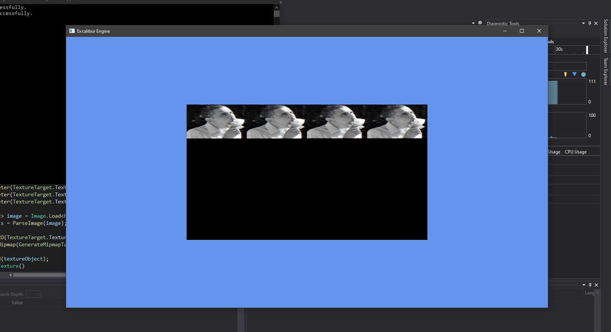

# Excalibur Engine

My second attempt to make a game engine with OpenGL.  
This time I'm using OpenTK's C# Bindings for OpenGL.

For whatever reason I keep coming across unorthodox problems I can't find a solution for anywhere on the internet.  
The official OpenTK documentation as of writing this is also slightly outdated for a few things as its now at v4.0 while the docs are still for v3.0.  
I looked to other documentation instead, such as the GLFW documentation, LWJGL documentation, learnopengl.com, etc..  
Theoretically, everything should work perfectly fine, but.. as is everything else in programming...

## Problems so far

1. Crashes when 'Close()' is called. I assume that it has something to do with deleting the vertex buffers on close while the loop has not stopped, causing the render method to be called while the vertex buffers are already deleted.
2. The biggest problem thus far.. I can't get textures to work, for some reason they show up as grayscale, small, and tiles horizontally.

